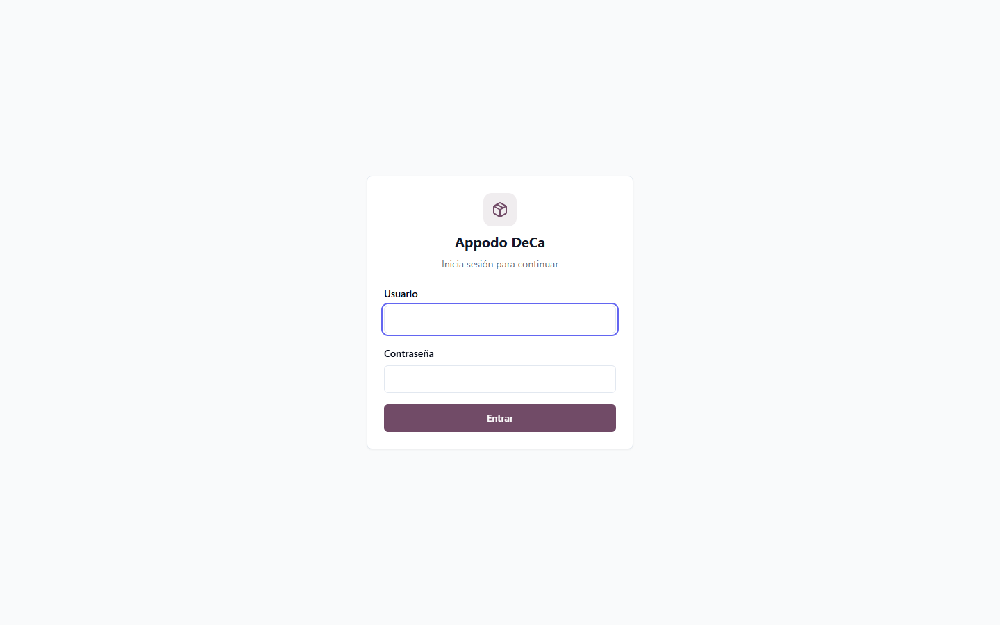
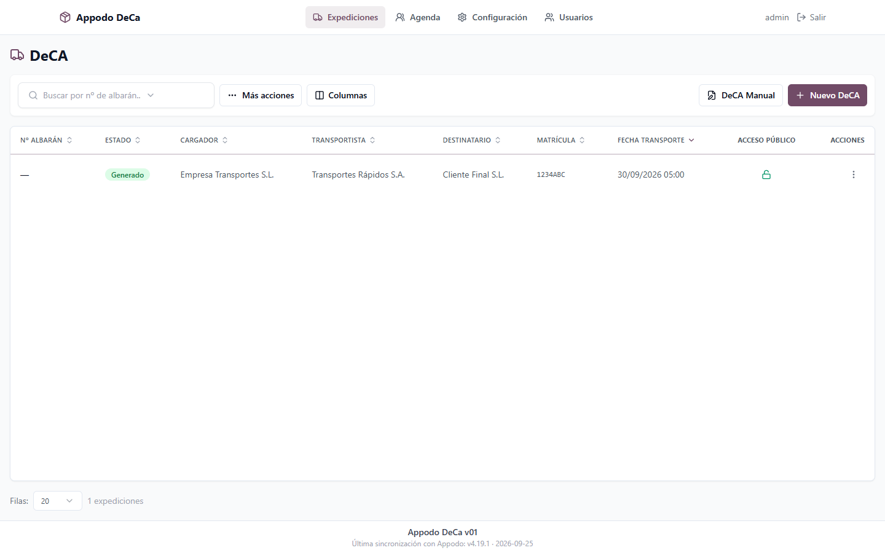
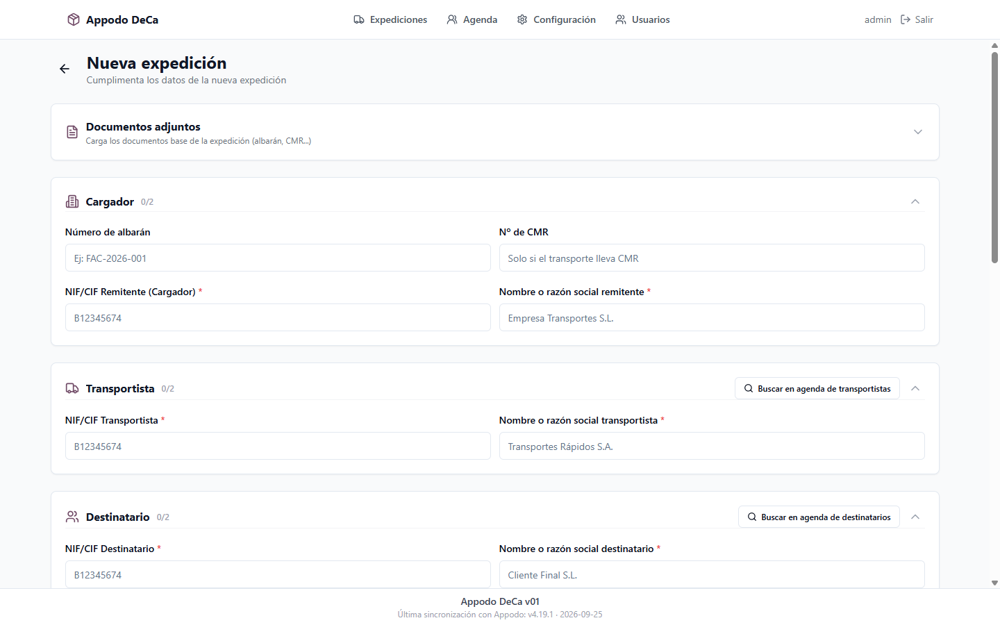
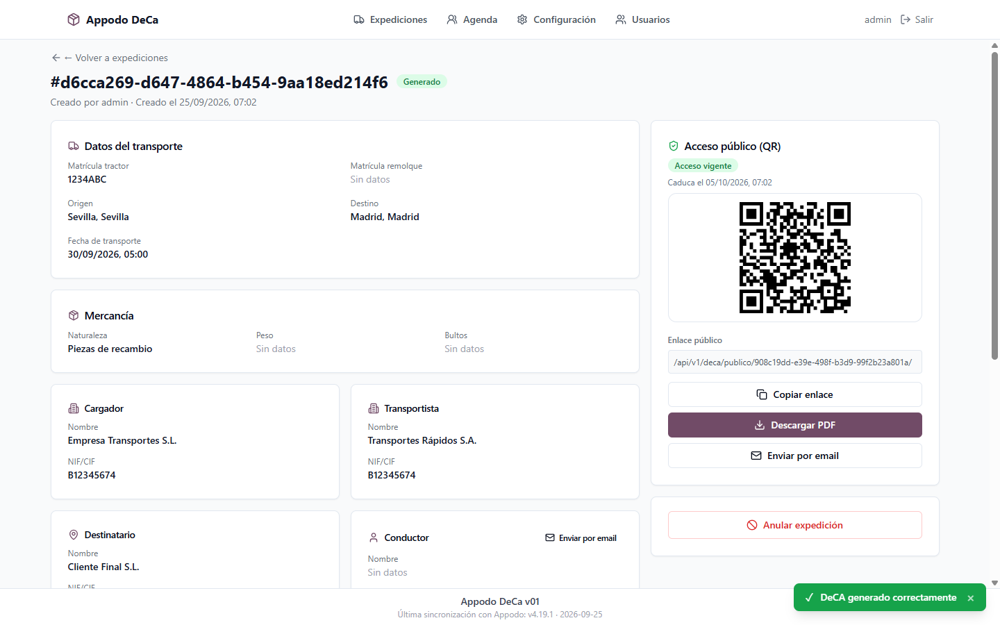
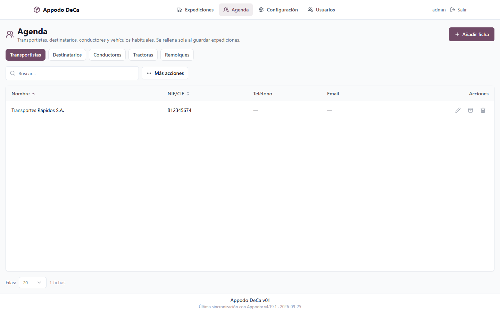
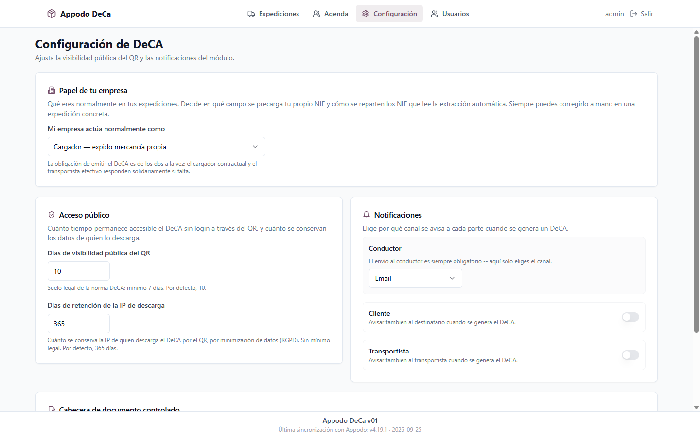

# Appodo DeCa

[](LICENSE)
[](CHANGELOG.md)
[](#stack)

**Appodo DeCa** es una app gratuita, autoalojable (self-hosted) y de código
abierto para gestionar el **Documento de Control Administrativo (DeCA)**
exigido en el transporte de mercancías por carretera en España (Orden
FOM/2861/2012; electrónico y con QR obligatorio desde el 5 de octubre de 2026
por la Resolución de 5 de junio de 2026): expediciones, agenda de
cargadores/transportistas/destinatarios/conductores/vehículos, lectura
automática del albarán/CMR de origen (con IA opcional que aprende de las
correcciones), generación del PDF oficial con QR de verificación pública y
trabajo en el móvil **sin cobertura**.

Es una extracción del módulo DeCA del [ERP Appodo](https://appodo.dev),
**single-tenant** (una instalación = una empresa, sin multi-tenant ni
permisos por rol complejos) — si necesitas más (control horario, facturación,
CRM, gestión multiempresa...), esa es la versión de pago.

> 🤝 **¿No quieres complicarte la vida instalándolo tú?** Te lo instalamos y
> mantenemos nosotros en tu propio servidor (o en el nuestro) — actualizaciones,
> copias de seguridad y soporte incluidos, con el ahorro de una instalación
> propia frente a una suscripción por usuario o por documento. Más info en
> [appodo.dev/appodo-deca](https://appodo.dev/appodo-deca) o escribe
> directamente a **juanf.jipa@gmail.com**.

## Funcionalidades

- **Ciclo de vida completo** de una expedición: borrador → confirmado →
  generado → anulado, con los datos obligatorios revisados contra el BOE
  (art. 6 de la Orden: domicilio del cargador, remolque salvo camión rígido,
  peso, bultos, autorización especial).
- **Corrección de un DeCA ya generado** dentro de un plazo configurable, con
  **motivo obligatorio** y, como exige la Resolución de 5-jun-2026, la
  sección «Modificaciones durante el servicio» en el mismo PDF (datos
  anteriores marcados «YA NO VÁLIDO», mismo QR, fechas de creación y
  modificación en los metadatos del PDF).
- **Lectura automática** del albarán/CMR (foto o PDF): patrones de texto +
  IA opcional (Gemini) de texto o de visión, con fotos enderezadas, aviso de
  fotos movidas, recorte «En el papel pone» de lo dudoso y lectura de
  matrículas españolas actuales, de remolque (R), provinciales antiguas y
  extranjeras.
- **La agenda manda**: lo que ya está en tu agenda prevalece sobre lo leído,
  con aviso de cada diferencia; el cargador (quien contrata) nunca se
  rellena solo.
- **La lectura aprende**: sinónimos de cómo aparece escrita cada ficha,
  correcciones anteriores como ejemplo para la IA, **modelos de documento**
  con valores fijos y panel de **precisión de lectura**.
- **Alta desde el móvil «a pleno sol»**: foto → solo lo que falta →
  comprobar → QR, con botones grandes y alto contraste.
- **DeCA sin cobertura**: PWA instalable; se rellena y se imprime en el
  móvil con su QR (generado en el propio móvil y adoptado por el servidor),
  y se registra solo al volver la red (Background Sync / Periodic Sync en
  Android). Modos configurables, ejemplares, registro de DeCA de papel por
  foto, DeCA anticipado con peso estimado y aviso por email de los que
  llegan sin completar.
- **Verificación pública por QR sin login**, con caducidad configurable
  (mínimo legal 7 días) y registro de cada acceso.
- **Historial de auditoría** append-only (quién cambió qué campo) exportable
  a PDF/Excel.
- Agenda con importación CSV, exportación de listados a PDF/Excel con
  cabecera de documento controlado opcional, envío por email con plantilla
  configurable, referencia de expedición configurable (albarán, CMR o
  contador automático) y validación del contenido real de cada fichero
  subido (PDF sin JavaScript ni adjuntos, imágenes íntegras, HEIC de iPhone).
- Roles admin/operador.

Manual de uso completo: [`docs/MANUAL_USO.md`](docs/MANUAL_USO.md).

## Capturas

| | |
|---|---|
|  |  |
|  |  |
|  |  |

## Stack

- **Backend:** Django 4.2 + Django REST Framework, PostgreSQL, JWT en
  cookies HttpOnly (`djangorestframework-simplejwt`).
- **Frontend:** React + Vite + Tailwind CSS + shadcn/ui.
- Roles: `is_staff` (admin, ve Configuración y gestión de usuarios) / usuario
  normal (operador, solo gestiona expediciones y agenda).

## Descarga e instalación rápida (Docker)

```bash
git clone https://github.com/jfjimen2022/appodo-deca.git
cd appodo-deca
cp .env.example .env
# edita .env: al menos SECRET_KEY, DB_PASSWORD, EMPRESA_NOMBRE
docker compose up -d
docker compose exec backend python manage.py createsuperuser
```

La app queda en `http://localhost:8080` (puerto configurable con
`HTTP_PORT` en `.env`).

Ver [`docs/INSTALACION.md`](docs/INSTALACION.md) para requisitos completos,
variables de entorno, backups y despliegue en un VPS.

## Desarrollo local (sin Docker)

```bash
# Backend
cd backend
python -m venv venv && source venv/bin/activate   # Windows: venv\Scripts\activate
pip install -r requirements.txt
cp .env.example .env   # y edítalo (DB_HOST=localhost, etc.)
python manage.py migrate
python manage.py createsuperuser
python manage.py runserver

# Frontend (en otra terminal)
cd frontend
npm install
cp .env.example .env
npm run dev
```

Tests: `python manage.py test deca` (backend, necesita PostgreSQL) y
`npm test` (frontend, vitest).

## Documentación

| Documento | Contenido |
|---|---|
| [`docs/MANUAL_USO.md`](docs/MANUAL_USO.md) | Manual de usuario final: cuatro casos paso a paso (móvil, oficina, corrección, sin cobertura), lectura automática, agenda, configuración y preparación de los móviles. |
| [`docs/INSTALACION.md`](docs/INSTALACION.md) | Requisitos, variables de entorno, backups, actualización, despliegue. |
| [`CHANGELOG.md`](CHANGELOG.md) | Registro de versiones y qué trae cada una. |
| [`docs/PLAN_EXTRACCION.md`](docs/PLAN_EXTRACCION.md) | Cómo se extrajo del ERP Appodo — decisiones de arquitectura, para quien quiera entender el porqué. |

## Licencia

[AGPL-3.0](LICENSE) — puedes usarlo, modificarlo y autoalojarlo libremente.
Si ofreces una versión modificada como servicio online, debes publicar tu
código bajo la misma licencia.

## Estado del proyecto

`v02` — sincronizado con el módulo DeCA de Appodo v4.37.0. Suite de tests
del backend (portada del ERP) y del frontend en verde, y verificado con
Docker (login → crear expedición → generar DeCA → descarga pública del PDF
sin sesión). Las capturas de arriba son de `v01`.
Quedan TODOs explícitos en el código (`TODO(standalone):`, ver
[`CHANGELOG.md`](CHANGELOG.md)) antes de considerarlo listo para producción
sin supervisión — ver el estado "Conocido / pendiente" de la versión
actual.

## Autor y contacto

Desarrollado por **Juan Fco Jiménez Pascual**, autor también del
[ERP Appodo](https://appodo.dev).

¿Tu empresa necesita implementarlo, personalizarlo, integrarlo con otros
sistemas, o simplemente quieres soporte, instalación gestionada o migrar a
la versión completa del ERP? Contacto:

📧 **juanf.jipa@gmail.com**
🌐 [appodo.dev/appodo-deca](https://appodo.dev/appodo-deca)
